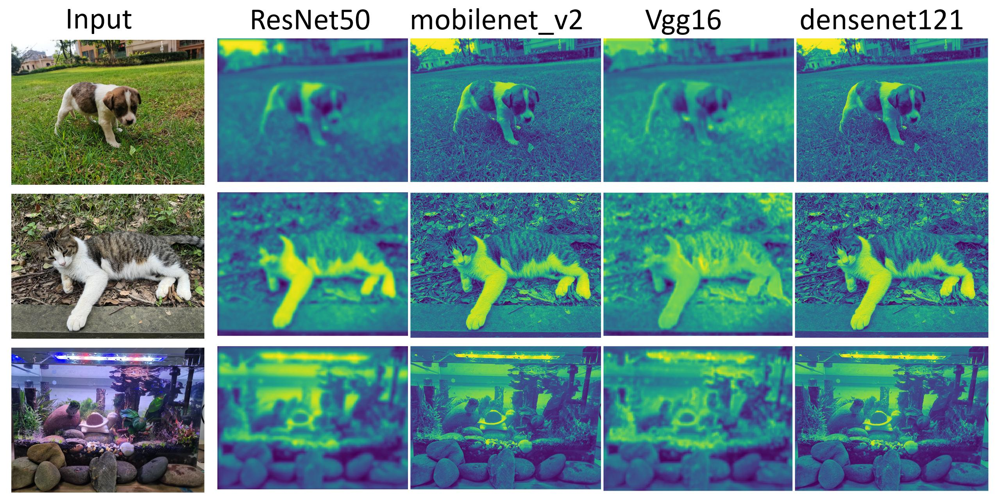
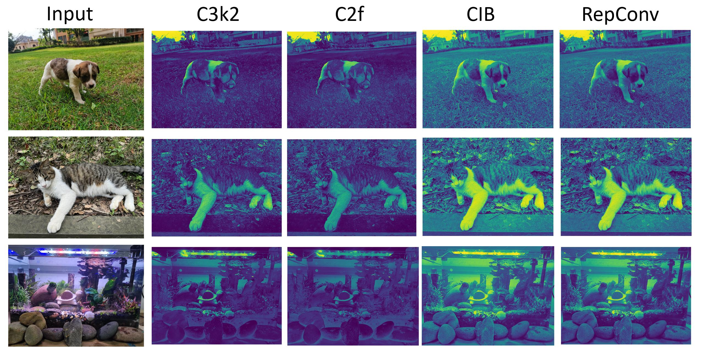

# An Test Tool for Module Analysis

------

**Description：**

1. Calculate the number of parameters and floating point of the model, as well as the model inference time
2. Visual feature map


**installation**

------

```
conda create -n analysis python=3.8 -y
pip install -r requirements.txt
```

```
torch==2.4.0 torchvision==0.19.0 torchaudio==2.4.0
```


**Quickly Start**

------

run compute_model_info.py 

You can compute `custom models` or models `officially implemented by pytorch`

Details of the official pytorch model can be found in [**Supported Models**](#Supported models)

```python
from utils.computing_function import computing_info

from model.conv import *
from model.block import *

if __name__ == '__main__':
    
    # Calculating custom model
    model = C3k2(c1=3, c2=64)  # replace your model/module
    computing_info(
        images_dir="./images",
        output_dir='./vis_result',
        model_name='C3k2',   # replace your model name
        device='cpu',
        model=model,
    )
    
    
	# Calculating the pytorch official implementation model
    computing_info(
        images_dir="./images",
        output_dir='./vis_result',
        model_name='resnet50',  
        device='cpu',
        model=model,
    )
```

**Case presentation**

------

visualization of some famous backbone



visualization of some famous block/Conv operation



## Supported models

more details can be found in `model/model_zoo.py`

```python
if model_name == 'resnet50':
    model = models.resnet50()
elif model_name == 'resnet101':
    model = models.resnet101()
elif model_name == 'vgg16':
    model = models.vgg16()
elif model_name == 'densenet121':
    model = models.densenet121()
elif model_name == 'mobilenet_v2':
    model = models.mobilenet_v2()
elif model_name == 'resnet18':
    model = models.resnet18()
elif model_name == 'resnet34':
    model = models.resnet34()
elif model_name == 'resnet152':
    model = models.resnet152()
elif model_name == 'vgg11':
    model = models.vgg11()
elif model_name == 'vgg13':
    model = models.vgg13()
elif model_name == 'vgg19':
    model = models.vgg19()
elif model_name == 'densenet169':
    model = models.densenet169()
elif model_name == 'densenet201':
    model = models.densenet201()
elif model_name == 'densenet161':
    model = models.densenet161()
elif model_name == 'mobilenet_v3_large':
    model = models.mobilenet_v3_large()
elif model_name == 'mobilenet_v3_small':
    model = models.mobilenet_v3_small()
elif model_name == 'inception_v3':
    model = models.inception_v3()
elif model_name == 'efficientnet_b0':
    model = models.efficientnet_b0()
elif model_name == 'efficientnet_b1':
    model = models.efficientnet_b1()
elif model_name == 'efficientnet_b7':
    model = models.efficientnet_b7()
elif model_name == 'shufflenet_v2_x0_5':
    model = models.shufflenet_v2_x0_5()
elif model_name == 'shufflenet_v2_x1_0':
    model = models.shufflenet_v2_x1_0()
elif model_name == 'squeezenet1_0':
    model = models.squeezenet1_0()
elif model_name == 'squeezenet1_1':
    model = models.squeezenet1_1()
elif model_name == 'alexnet':
    model = models.alexnet()
elif model_name == 'googlenet':
    model = models.googlenet()
elif model_name == 'regnet_y_400mf':
    model = models.regnet_y_400mf()
elif model_name == 'regnet_y_800mf':
    model = models.regnet_y_800mf()
elif model_name == 'regnet_x_1_6gf':
    model = models.regnet_x_1_6gf()
elif model_name == 'convnext_tiny':
    model = models.convnext_tiny()
elif model_name == 'convnext_small':
    model = models.convnext_small()
elif model_name == 'convnext_base':
    model = models.convnext_base()
elif model_name == 'convnext_large':
    model = models.convnext_large()
elif model_name == 'efficientnet_v2_s':
    model = models.efficientnet_v2_s()
elif model_name == 'efficientnet_v2_m':
    model = models.efficientnet_v2_m()
elif model_name == 'efficientnet_v2_l':
    model = models.efficientnet_v2_l()
elif model_name == 'mnasnet0_5':
    model = models.mnasnet0_5()
elif model_name == 'mnasnet0_75':
    model = models.mnasnet0_75()
elif model_name == 'mnasnet1_0':
    model = models.mnasnet1_0()
elif model_name == 'mnasnet1_3':
    model = models.mnasnet1_3()
elif model_name == 'regnet_y_1_6gf':
    model = models.regnet_y_1_6gf()
elif model_name == 'regnet_y_3_2gf':
    model = models.regnet_y_3_2gf()
elif model_name == 'regnet_y_16gf':
    model = models.regnet_y_16gf()
elif model_name == 'regnet_x_3_2gf':
    model = models.regnet_x_3_2gf()
elif model_name == 'regnet_x_8gf':
    model = models.regnet_x_8gf()
elif model_name == 'vit_b_16':
    model = models.vit_b_16()
elif model_name == 'vit_b_32':
    model = models.vit_b_32()
elif model_name == 'vit_l_16':
    model = models.vit_l_16()
elif model_name == 'vit_l_32':
    model = models.vit_l_32()
elif model_name == 'swin_t':
    model = models.swin_t()
elif model_name == 'swin_s':
    model = models.swin_s()
elif model_name == 'swin_b':
    model = models.swin_b()
elif model_name == 'swin_l':
    model = models.swin_l()
else:
    print(f"Model {model_name} is not in model zoo.")
```

## Contact 

If you have any question or suggestion, please feel free to contact us by [raising an issue](https://github.com/glory-wan/LLIE-Lib/issues) or sending an email to glory947446@gmail.com.

## License

This res is licensed under the MIT License. See the LICENSE file for more details.